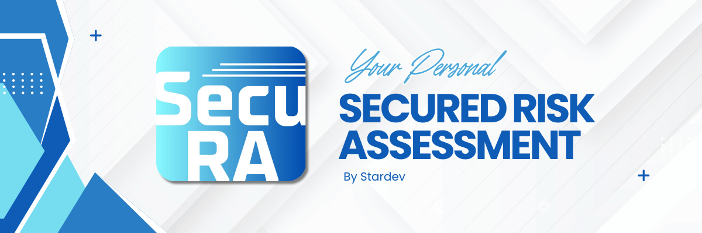

# SECURA - Risk Assessment System

<div align="center">
  
</div>

## About
SecuRA (Secured Risk Assessment) is a cutting-edge, web-based platform designed to replace outdated and inefficient risk management systems. With a focus on automation, security, and ease of use, SecuRA revolutionizes the way organizations track assets, assess risks, and generate audit reports. By moving away from manual processes like Excel, SecuRA offers a streamlined solution that enhances efficiency and minimizes human error.

Built on the robust Laravel framework and utilizing the Orchid Laravel template, SecuRA provides an intuitive admin panel, real-time dynamic features via AJAX, and seamless integration for asset management, risk assessment, and automated report generation in PDF format. The platform includes powerful tools for asset tracking, threat identification, asset valuation, and bulk editing of risk assessments. With role-based access control, SecuRA ensures secure handling of sensitive data.

SecuRA integrates advanced search capabilities using Laravel Scout and meets the highest cybersecurity standards, making it an ideal choice for businesses looking to modernize their risk management processes and ensure compliance. It offers a scalable, secure, and efficient solution for managing and mitigating risks in a rapidly changing environment.

## Features
- Risk assessment and asset management
- Search functionality with Laravel Scout
- File attachments support
- Asset valuation and threat assessment
- User management and access control
- Export capabilities (PDF)
- Modern UI with Livewire

## Tech Stack
- PHP 8.2+
- Laravel 11.x
- Orchid Platform 14.x
- Livewire 3.x
- Laravel Scout
- MySQL/PostgreSQL
- Tailwind CSS

## Requirements
- PHP >= 8.2
- Composer
- Node.js & NPM
- MySQL/PostgreSQL
- Web Server (Apache/Nginx)

## Installation
1. Clone the repository:
```bash
git clone [repository-url]
```

2. Install PHP dependencies:
```bash
composer install
```

3. Install NPM dependencies:
```bash
npm install
```

4. Configure environment:
```bash
cp .env.example .env
php artisan key:generate
```

5. Configure database in `.env` file:
```env
DB_CONNECTION=mysql
DB_HOST=127.0.0.1
DB_PORT=3306
DB_DATABASE=your_database
DB_USERNAME=your_username
DB_PASSWORD=your_password
```

6. Run migrations:
```bash
php artisan migrate
```

7. Build assets:
```bash
npm run build
```

8. Start the development server:
```bash
php artisan serve
```

## Key Components
- `app/Models/Management/AssetManagement.php`: Core asset management model
- `app/Orchid/Screens/Management/`: Asset management screens
- `app/Orchid/Presenters/`: Data presenters
- `app/Models/Assessment/`: Asset assessment models

## Features in Detail
1. **Asset Management**
   - Create, read, update, and delete assets
   - Track asset location, custodian, and ownership
   - Asset status monitoring
   - Quantity tracking

2. **Search & Filtering**
   - Full-text search using Laravel Scout
   - Advanced filtering options
   - Sortable columns

3. **File Management**
   - Attach documents to assets
   - Support for multiple file types
   - Secure file storage

4. **Export Options**
   - Excel export using Maatwebsite/Excel
   - PDF export using DomPDF
   - Customizable export formats

## Contributing
Please read our contributing guidelines before submitting pull requests.

## License
This project is licensed under the MIT License.
